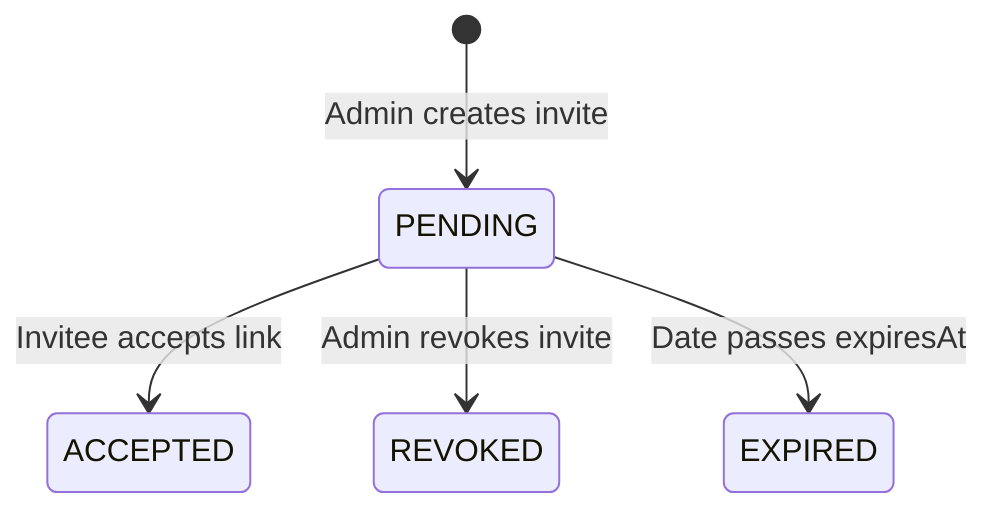

# Data Model: Multi-Tenancy & Organizations

**Feature**: Multi-Tenancy & Organizations (`001-multi-tenant-organizations`)  
**Date**: 2026-08-06  
**Status**: Complete  

## Prisma Schema Extensions

### Enums

```prisma
enum OrganizationRole {
  OWNER
  ADMIN
  MEMBER
}

enum InviteStatus {
  PENDING
  ACCEPTED
  REVOKED
  EXPIRED
}
```

### Models

```prisma
model Organization {
  id        String   @id @default(uuid())
  name      String
  slug      String   @unique
  createdAt DateTime @default(now())
  updatedAt DateTime @updatedAt

  members   OrganizationMember[]
  invites   OrganizationInvite[]
}

model OrganizationMember {
  id             String           @id @default(uuid())
  organizationId String
  userId         String
  role           OrganizationRole @default(MEMBER)
  joinedAt       DateTime         @default(now())

  organization   Organization     @relation(fields: [organizationId], references: [id], onDelete: Cascade)
  user           User             @relation(fields: [userId], references: [id], onDelete: Cascade)

  @@unique([organizationId, userId])
  @@index([userId])
  @@index([organizationId])
}

model OrganizationInvite {
  id             String           @id @default(uuid())
  organizationId String
  email          String
  role           OrganizationRole @default(MEMBER)
  token          String           @unique
  status         InviteStatus     @default(PENDING)
  expiresAt      DateTime
  inviterId      String
  createdAt      DateTime         @default(now())

  organization   Organization     @relation(fields: [organizationId], references: [id], onDelete: Cascade)
  inviter        User             @relation(fields: [inviterId], references: [id], onDelete: Cascade)

  @@index([organizationId])
  @@index([email])
}
```

## Entity State Transitions

### OrganizationInvite State Machine


