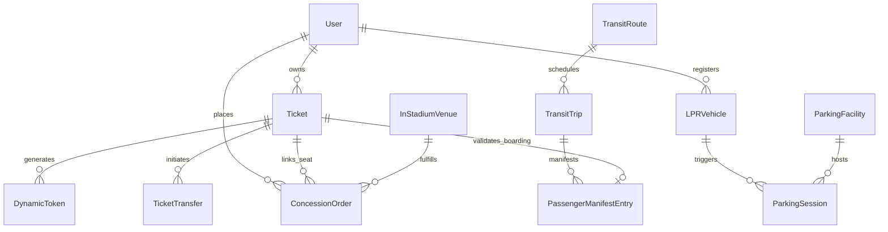

# Data Model: Unified Super-App (Ticketing, LPR Parking & Transit)

**Feature**: Unified Super-App for Resilient Ticketing, LPR Parking & Interprovincial Transit  
**Directory**: `specs/003-super-app-ticketing-logistics`  
**Date**: 2026-08-07  

---

## Entity Relationship Overview



---

## Prisma Schema Definitions

```prisma
enum Role {
  USER
  GATE_STAFF
  BUS_DRIVER
  CONCESSION_RUNNER
  ADMIN
}

enum TicketStatus {
  ACTIVE
  TRANSFERRED
  USED
  CANCELLED
}

enum ParkingSessionStatus {
  ACTIVE
  COMPLETED
  PAYMENT_FAILED
}

enum TripStatus {
  SCHEDULED
  BOARDING
  IN_TRANSIT
  COMPLETED
  CANCELLED
}

enum BoardingStatus {
  PENDING
  BOARDED
  NO_SHOW
}

enum ConcessionOrderStatus {
  QUEUED_OFFLINE
  RECEIVED
  PREPARING
  OUT_FOR_DELIVERY
  DELIVERED
  CANCELLED
}

enum TransferStatus {
  PENDING
  ACCEPTED
  RECLAIMED
  EXPIRED
}

model User {
  id               String            @id @default(uuid())
  email            String            @unique
  name             String?
  nationalId       String?           @unique // National Civil Identity for offline verification
  phone            String?
  role             Role              @default(USER)
  createdAt        DateTime          @default(now())
  updatedAt        DateTime          @updatedAt
  
  tickets          Ticket[]
  vehicles         LPRVehicle[]
  parkingSessions  ParkingSession[]
  concessionOrders ConcessionOrder[]
  sentTransfers    TicketTransfer[]  @relation("SentTransfers")
  receivedTransfers TicketTransfer[] @relation("ReceivedTransfers")
}

model Ticket {
  id               String            @id @default(uuid())
  userId           String
  user             User              @relation(fields: [userId], references: [id])
  eventTitle       String
  venueName        String
  eventDate        DateTime
  zone             String            // e.g. "North Stand", "VIP"
  row              String            // e.g. "Row 12"
  seatNumber       String            // e.g. "Seat 4"
  ticketSecret     String            // Cryptographic seed for dynamic HMAC-SHA256 tokens
  status           TicketStatus      @default(ACTIVE)
  entryTimestamp   DateTime?
  scannedByGateId  String?
  createdAt        DateTime          @default(now())
  updatedAt        DateTime          @updatedAt

  dynamicTokens    DynamicToken[]
  transfers        TicketTransfer[]
  concessionOrders ConcessionOrder[]
  manifestEntries  PassengerManifestEntry[]
}

model DynamicToken {
  id               String            @id @default(uuid())
  ticketId         String
  ticket           Ticket            @relation(fields: [ticketId], references: [id], onDelete: Cascade)
  tokenPayload     String            // Base64 HMAC-SHA256 payload
  timestampWindow  Int               // 30-second epoch counter
  expiresAt        DateTime
  isConsumed       Boolean           @default(false)
  consumedAt       DateTime?

  @@unique([ticketId, timestampWindow])
}

model LPRVehicle {
  id               String            @id @default(uuid())
  userId           String
  user             User              @relation(fields: [userId], references: [id])
  plateNumber      String            @unique // Normalized uppercase alphanumeric (e.g. "ABC-1234")
  make             String?
  model            String?
  color            String?
  isPrimary        Boolean           @default(true)
  createdAt        DateTime          @default(now())

  sessions         ParkingSession[]
}

model ParkingFacility {
  id               String            @id @default(uuid())
  name             String
  location         String
  hourlyTariff     Decimal           @default(2.50)
  gracePeriodMins  Int               @default(15)
  totalBays        Int               @default(100)
  activeVehicles   Int               @default(0)

  sessions         ParkingSession[]
}

model ParkingSession {
  id               String                @id @default(uuid())
  facilityId       String
  facility         ParkingFacility       @relation(fields: [facilityId], references: [id])
  vehicleId        String
  vehicle          LPRVehicle            @relation(fields: [vehicleId], references: [id])
  userId           String
  user             User                  @relation(fields: [userId], references: [id])
  entryTime        DateTime              @default(now())
  exitTime         DateTime?
  durationMinutes  Int?
  totalBilled      Decimal?              @default(0.00)
  status           ParkingSessionStatus  @default(ACTIVE)
  entryGateId      String
  exitGateId       String?
  receiptUrl       String?
}

model TransitRoute {
  id               String            @id @default(uuid())
  routeName        String            // e.g. "Quito - Guayaquil Direct"
  originCity       String
  destinationCity  String
  estimatedHours   Decimal

  trips            TransitTrip[]
}

model TransitTrip {
  id               String            @id @default(uuid())
  routeId          String
  route            TransitRoute      @relation(fields: [routeId], references: [id])
  busUnitNumber    String            // e.g. "Bus 42"
  driverName       String
  departureTime    DateTime
  arrivalTime      DateTime?
  status           TripStatus        @default(SCHEDULED)
  currentGpsLat    Float?
  currentGpsLng    Float?
  currentSpeedKmh  Float?
  lastTelemetryAt  DateTime?
  shareToken       String            @unique @default(cuid())

  manifestEntries  PassengerManifestEntry[]
}

model PassengerManifestEntry {
  id               String            @id @default(uuid())
  tripId           String
  trip             TransitTrip       @relation(fields: [tripId], references: [id], onDelete: Cascade)
  ticketId         String?
  ticket           Ticket?           @relation(fields: [ticketId], references: [id])
  passengerName    String
  nationalId       String            // For offline lookup when phone is dead
  seatNumber       String
  boardingStatus   BoardingStatus    @default(PENDING)
  boardedAt        DateTime?
  validatedOffline Boolean           @default(false)
}

model InStadiumVenue {
  id               String            @id @default(uuid())
  name             String
  concessionZones  String[]          // List of serviced zones

  concessionOrders ConcessionOrder[]
}

model ConcessionOrder {
  id               String                 @id @default(uuid())
  venueId          String
  venue            InStadiumVenue         @relation(fields: [venueId], references: [id])
  userId           String
  user             User                   @relation(fields: [userId], references: [id])
  ticketId         String?
  ticket           Ticket?                @relation(fields: [ticketId], references: [id])
  seatZone         String
  seatRow          String
  seatNumber       String
  itemsJson        Json                   // Items ordered with quantities and unit prices
  totalAmount      Decimal
  deliveryPin      String                 // 4-digit code attendee gives to runner
  status           ConcessionOrderStatus  @default(RECEIVED)
  runnerName       String?
  createdAt        DateTime               @default(now())
  deliveredAt      DateTime?
}

model TicketTransfer {
  id               String            @id @default(uuid())
  ticketId         String
  ticket           Ticket            @relation(fields: [ticketId], references: [id])
  senderId         String
  sender           User              @relation("SentTransfers", fields: [senderId], references: [id])
  recipientEmail   String?
  recipientPhone   String?
  recipientId      String?
  recipient        User?             @relation("ReceivedTransfers", fields: [recipientId], references: [id])
  claimSecret      String            @unique @default(cuid())
  status           TransferStatus    @default(PENDING)
  expiresAt        DateTime
  createdAt        DateTime          @default(now())
}
```

---

## Validation & Business Rules

1. **Dynamic Token Rotation**:
   - `DynamicToken` payload computes from `HMAC-SHA256(ticketSecret, floor(unixEpoch / 30))`.
   - Tolerance window allows `window - 1`, `window`, and `window + 1` (90s maximum total skew tolerance).
2. **LPR Normalization**:
   - `plateNumber` is stripped of spaces, dashes, and lowercase characters (`ABC-1234` -> `ABC1234`).
   - Duplicate active sessions for the same plate in the same facility are prevented by uniqueness constraints.
3. **National ID Verification**:
   - If passenger mobile phone is dead, looking up `nationalId` against `PassengerManifestEntry` allows 1-click boarding with `validatedOffline: true`.
4. **In-Stadium Delivery Routing**:
   - `ConcessionOrder` must contain non-empty `seatZone`, `seatRow`, `seatNumber`, and a generated 4-digit `deliveryPin`.
5. **Transfer Invalidation**:
   - Initiating a `TicketTransfer` places the ticket in `TRANSFERRED` pending state, locking dynamic token generation on the sender's client until accepted or reclaimed.
